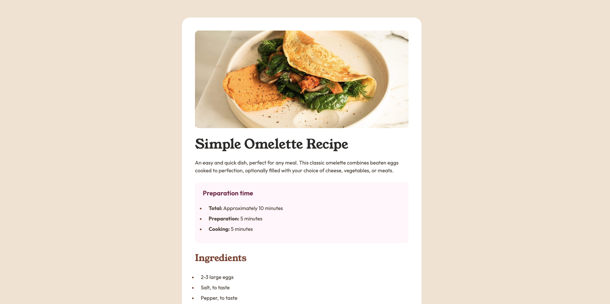

# Frontend Mentor - Recipe page solution

This is a solution to the [Recipe page challenge on Frontend Mentor](https://www.frontendmentor.io/challenges/recipe-page-KiTsR8QQKm). Frontend Mentor challenges help you improve your coding skills by building realistic projects. 

## Table of contents

- [Overview](#overview)
  - [Screenshot](#screenshot)
  - [Links](#links)
- [My process](#my-process)
  - [Built with](#built-with)
  - [What I learned](#what-i-learned)
- [Author](#author)

## Overview

### Screenshot




### Links

- Solution URL: [https://github.com/angie-create/recipe-page](https://github.com/angie-create/recipe-page)
- Live Site URL: [https://angie-create.github.io/recipe-page/](https://angie-create.github.io/recipe-page/)

## My process

### Built with

- CSS
- HTML

### What I learned

I learned how to style tables and lists.

```css
Proud of this code:

table {
    & {
      border-collapse: collapse;
      margin-top: 1.5rem;
      text-align: left;
      width: 100%;
    }
    
    & td {
      color: var(--color-brown-800, #854632);
      font-weight: 700;
    }

    & th {
      padding-left: 2rem;
      color: var(--color-stone-600, #5F564D);
      font-weight: 400;
      width: 51%;
    }

    :is(th, td) {
      tr:not(:first-of-type) & {
        padding-top: .75rem;
      }

      tr:not(:last-of-type) & {
        border-bottom: 1px solid var(--color-brown-800, #854632);
        padding-bottom: .75rem;
      }
    }
}
```
## Author

- LinkedIn - [Angelica Parada](https://www.linkedin.com/in/angelica-parada/)
- Frontend Mentor - [@angie-create](https://www.frontendmentor.io/profile/angie-create)
